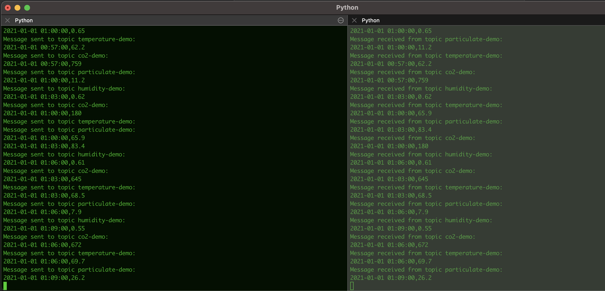

# Air Quality Monitoring

This project is a work in progress. Ultimately it will use real sensor data to enable real-time monitoring of air quality conditions inside of a home or other space. It's a demonstration of how we can process sensor data, stream it to kafka, and then add front end functionality in real time, such as dashboards, etc. Below you will find the individual steps. Please note that this project will be completed first using generated dummy data which will kinda sorta maybe simulate real conditions (i.e. temperatures will be, on average, lower at night).

1. Data Generation: Create a dataset that includes temperature, humidity, carbon dioxide levels, and particulate matter levels data. This data will initially be randomly generated with some hard coded rules to simulate the real data. (this is now done)

2. Data Ingestion: Stream the generated data into the Kafka messaging system. We will use the Kafka producer API to write code that pushes the data into a Kafka topic. (v1 of this step is complete. we are streaming data to kafka and then printing it to the console from our consumer)

3. Data Processing: Use Apache Kafka Connect to move the data from Kafka to a database. We can use the Kafka Connect API to write code that reads data from a Kafka topic and writes it to the database.

4. Data Storage: Store the data in a database.

5. Data Visualization: we will create a simple front-end or dashboard to display the data. we can use a JavaScript framework such as React or Angular to build the front-end and connect it to the database.

6. Data Processing: we can write Python code that processes the data and performs any necessary data manipulations or machine learning algorithms. This code can be executed as part of a data processing pipeline, which can be scheduled to run on a regular basis or in real-time as new data is ingested.

7. Deployment: Deploy the system using Docker containers and manage the deployment using Kubernetes. This will allow us to easily scale the system as needed and ensure that the components are isolated and running in a consistent environment.

### Data Generation
The main data generation occurs in the `GenerateDatasets.py` file. Run this file using `python GenerateDatasets.py`. That will populate the csv files which we'll use for simulated data. For now, we'll simulate one data reading per sensor (i.e. temperature, co2 levels, particulate matter levels, and humidity).
    
There is a base class to help with data generation called `DataGenerator.py`

The other classes inherit from this base class. An example is `TemperatureDataGenerator`. `GenerateDatasets.py` is run, which populates all the fake data in the csv files. The schema for each includes 2 columns. The first column is a datetime, and the second is whatever variable we are measuring such as temperature or co2_levels.

Eventually this data will be replaced with actual sensor data. 

### Data Ingestion
The data is ingested using kafka producers and consumers. There is a producer for each sensor type, such as `TemperatureProducer.py`. Each producer streams data to it's own topic. The producers can be run concurrently using the `KafkaProducerRunner.py` class. 

Then there is a single consumer which reads data from all of the topics.

Having multiple producers stream data to multiple topics allows for a more flexible and scalable data pipeline. The producers can be deployed on separate machines or in separate parts of the same system, and each producer can be responsible for producing data for a specific topic.

A single consumer can then subscribe to multiple topics and consume messages from all of them. This allows the consumer to process all of the data produced by the producers in a centralized manner, which can be useful for tasks such as aggregating data, performing data transformations, or sending the data to another system for further processing.

To test that kafka is functioning correctly, we can do the following:

1. run from a virtual environment by running the following commands (on mac)

```
virtualenv venv
source venv/bin/activate
```

1. In a terminal run the following command from the producers directory to start the streaming

```
python KafkaProducerRunner.py
```

1. Run the following command from the consumers directory to start consuming the data from the topics 

```
python DataConsumer.py
```

4. After running these commands you should see something like:



That tells you that the stream is working correctly. 

### TODO
* Steps 3-7 need to be completed
* Replace dummy data with actual sensor data
* Testing
* Introduce inheritance in the producer classes to reduce redundant code? Also consider just making util classes which perform things like message serialization, or reading from the csv
* Add error handling and logging